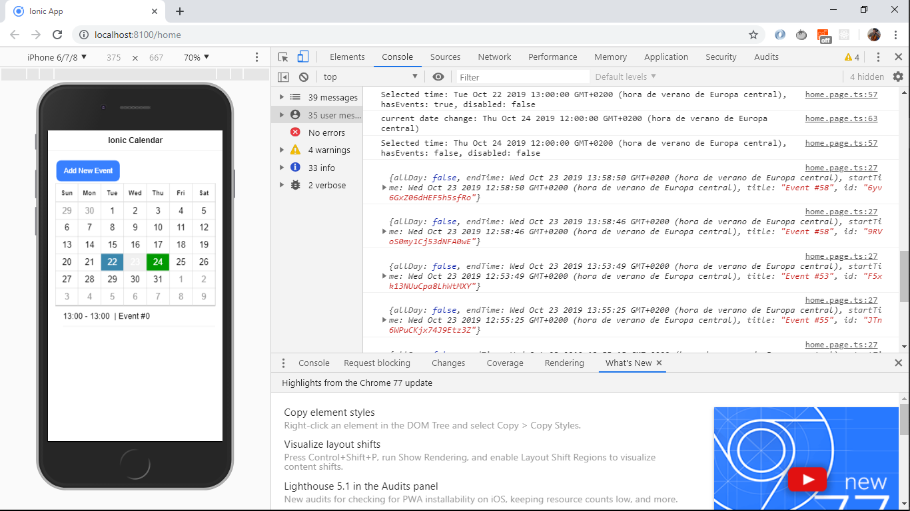

# :zap: Ionic Angular Calendar

* App to show an Ionic calendar with events stored in Firebase. This is another great tutorial from [Jameson Saunders of JamiBot, Youtube video 'Ionic 4 Custom Calendar Tutorial'](https://www.youtube.com/watch?v=SYz-tH3XOF8&t=766s) that I have updated.


## :page_facing_up: Table of contents

* [:zap: Ionic Angular Calendar](#zap-ionic-angular-calendar)
  * [:page_facing_up: Table of contents](#page_facing_up-table-of-contents)
  * [:books: General info](#books-general-info)
  * [:camera: Screenshots](#camera-screenshots)
  * [:signal_strength: Technologies](#signal_strength-technologies)
  * [:floppy_disk: Setup](#floppy_disk-setup)
  * [:computer: Code Examples](#computer-code-examples)
  * [:cool: Features](#cool-features)
  * [:clipboard: Status & To-do list](#clipboard-status--to-do-list)
  * [:clap: Inspiration](#clap-inspiration)
  * [:file_folder: License](#file_folder-license)
  * [:envelope: Contact](#envelope-contact)

## :books: General info

* Uses the [ionic2-calendar](https://www.npmjs.com/package/ionic2-calendar) package to display events input by the user.
* This app is set up to use a Google Firebase backend to store calender entries.

## :camera: Screenshots



## :signal_strength: Technologies

* [Ionic v6](https://ionicframework.com/)
* [Ionic/angular v6](https://ionicframework.com/)
* [Angular v15](https://angular.io/)
* [ionic2-calendar v0.6.9](https://www.npmjs.com/package/ionic2-calendar)
* [Angular/Fire v7](https://www.npmjs.com/package/@angular/fire) for Google Firebase Database connection.

## :floppy_disk: Setup

* Create a Google Firebase database and add access credentials to environment.ts
* To start the server on _localhost://8100_ type: 'ionic serve'
* To start the server on a mobile using Ionic devapp and connected via wifi, type: 'ionic serve --devapp'
* The Ionic DevApp was installed on an Android device from the Google Play app store.

## :computer: Code Examples

* function to add a new event - including start and end time. Title is derived from seconds and is intended to create semi-random data.

```typescript
  addNewEvent() {
    const start = this.selectedDate;
    const end = this.selectedDate;
    end.setMinutes(end.getMinutes() + 60);

    const event = {
      title: 'Event #' + start.getMinutes(),
      startTime: start,
      endTime: end,
      allDay: false
    };

    this.db.collection('events').add(event);
  }
```

## :cool: Features

* Google Firebase storage of calendar events. Data is retrieved from Firebase in the constructor function at the beginning of the page lifecycle.
* Calender date format can be changed using options from the ionic2-calender.

## :clipboard: Status & To-do list

* Status: Working
* To-do: A lot more complexity can be added to this calendar app. The option to change the view from day to week to month would be useful - as shown in the [demo project](https://github.com/twinssbc/Ionic2-Calendar/tree/v5/demo).

## :clap: Inspiration

* [Jameson Saunders of JamiBot, Youtube video 'Ionic 4 Custom Calendar Tutorial'](https://www.youtube.com/watch?v=SYz-tH3XOF8&t=766s)
* [Ionic2-Calendar github repo](https://github.com/twinssbc/Ionic2-Calendar)
* [demo project](https://github.com/twinssbc/Ionic2-Calendar/tree/v5/demo).

## :file_folder: License

* N/A

## :envelope: Contact

* Repo created by [ABateman](https://github.com/AndrewJBateman), email: gomezbateman@yahoo.com
